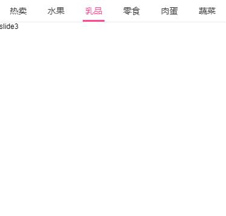

## Swiper4.x使用笔记

## 介绍
> Swiper4.x版本的使用记录

> [4.x与3.x,API变化说明](http://www.swiper.com.cn/api/index.html)

## 文档参考
+ [Swiper中文网](http://www.swiper.com.cn/usage/index.html)

## Demo功能说明

> ### 案例1[D0101]
+ 手机端，可以拖动和自动居中的效果
+ [在线演示](http://www.swiper.com.cn/demo/fresh/)
+ 搭配Vue模板功能使用[D0102]
#### 效果

  

